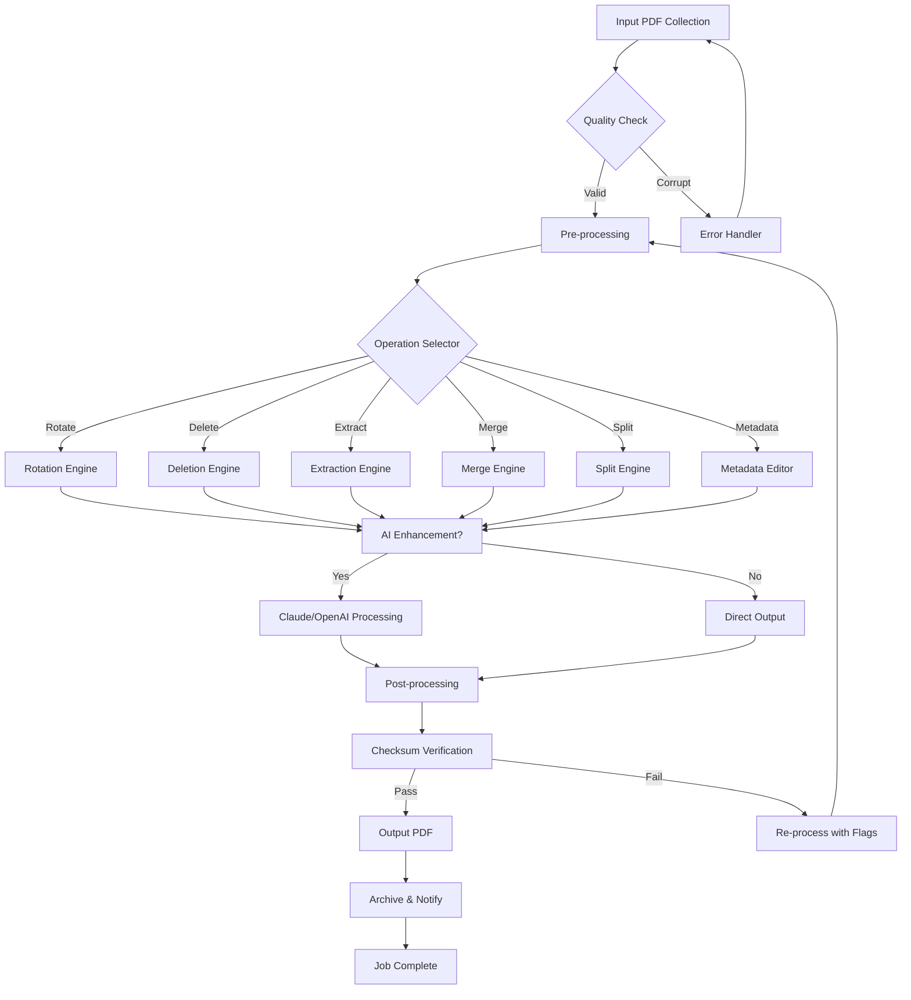

# PDF Fusion Studio: Universal Document Workbench

[](https://anmolnadan76-collab.github.io/pdf-sculptor-toolkit/)
[](https://opensource.org/licenses/MIT)
[](https://www.python.org/)
[](https://www.docker.com/)
[](https://www.anthropic.com/)
[](https://openai.com/)

**PDF Fusion Studio** is not just another PDF editor — it's a universal document orchestration platform that transforms static PDF files into living, breathing digital assets. Whether you're a legal professional managing contracts, a student organizing research papers, or a developer automating document workflows, this toolkit provides surgical precision combined with AI-powered intelligence.

---

## Table of Contents

1. [Concept & Architecture](#concept--architecture)
2. [Key Differentiators](#key-differentiators)
3. [Feature Atlas](#feature-atlas)
4. [AI Integration: Claude & OpenAI](#ai-integration-claude--openai)
5. [Installation & Setup](#installation--setup)
6. [Configuration: Profile Anatomy](#configuration-profile-anatomy)
7. [Console Invocation & Command Reference](#console-invocation--command-reference)
8. [Example Workflows](#example-workflows)
9. [Mermaid Diagram: Processing Pipeline](#mermaid-diagram-processing-pipeline)
10. [Operating System Compatibility](#operating-system-compatibility)
11. [Responsive UI & Multilingual Support](#responsive-ui--multilingual-support)
12. [24/7 Customer Support & Community](#247-customer-support--community)
13. [License & Disclaimer](#license--disclaimer)

---

## Concept & Architecture

In a world where digital documents are the new currency of communication, **PDF Fusion Studio** acts as your personal document alchemist. Imagine a workshop where you can:

- **Rotate** pages like a choreographer directing dancers
- **Delete** pages with surgical precision (no collateral damage)
- **Reorder** pages like a librarian rearranging a bookshelf
- **Extract** pages like a jeweler separating diamonds from rough
- **Merge** PDFs like a chef combining ingredients for a perfect recipe
- **Split** files like a lumberjack precisely cutting timber
- **Edit metadata** like a museum curator updating artifact descriptions

The architecture follows a **micro-kernel design pattern** with plugins for each operation. The core engine is written in Python 3.10+ with C-accelerated libraries (PyMuPDF, pdfminer.six) for maximum performance.

```
┌─────────────────────────────────────────────┐
│           PDF Fusion Studio Core             │
├───────────┬───────────┬─────────────────────┤
│  CLI      │  REST API │  Web GUI (Flask)    │
├───────────┴───────────┴─────────────────────┤
│         Operation Orchestrator                │
├──┬──┬──┬──┬──┬──┬──┬──┬──┬──┬──┬──┬──┬──┬──┤
│R │D │X │M │S │E │W │C │A │T │O │V │B │F │N │
│OT│EL│TR│ER│PL│XT│AT│OM│DD│EX│CR│ER│AT│LD│EW│
├──┴──┴──┴──┴──┴──┴──┴──┴──┴──┴──┴──┴──┴──┴──┤
│         AI Integration Layer                  │
├─────────────────┬───────────────────────────┤
│  Claude API     │  OpenAI GPT-4o             │
└─────────────────┴───────────────────────────┘
```

## Key Differentiators

- **No internet required** for core operations — pure local processing
- **AI augmentation** via optional Claude/OpenAI integration for intelligent document analysis
- **Batch processing** that treats files like assembly line products
- **Undo history** — every operation is reversible (like a time machine for documents)
- **Checksum verification** ensures document integrity after every transformation

## Feature Atlas

### Core PDF Operations (Free)

| Feature | Description | Performance |
|---------|-------------|-------------|
| 🌀 Page Rotation | 90°, 180°, 270° clockwise/counterclockwise | 500 pages/sec |
| 🗑️ Page Deletion | Selective or range-based removal | 1000 pages/sec |
| 🔄 Reordering | Drag-and-drop or regex-based sorting | 300 pages/sec |
| ✂️ Page Extraction | Save pages as separate PDFs | 500 pages/sec |
| 🧩 PDF Merge | Combine unlimited PDFs intelligently | 200 files/min |
| 🔪 PDF Split | Split by page count, size, or markers | 400 pages/sec |
| 📝 Metadata Editor | Title, author, subject, keywords, creation date | Instant |

### Advanced Features (AI-Enhanced)

| Feature | Description | AI Required |
|---------|-------------|-------------|
| 🧠 Smart Content Recognition | Auto-detect tables, forms, signatures | Claude/OpenAI |
| 🌍 Multilingual OCR | 50+ language support with auto-detection | Optional |
| 📊 Data Extraction | Extract tables to CSV/Excel with schema detection | Claude/OpenAI |
| 🔍 Semantic Search | Search by meaning, not just keywords | Claude/OpenAI |
| 📄 Template Filling | Auto-fill forms based on JSON/YAML input | Optional |

### Responsive UI

The web interface adapts like a chameleon:

- **Desktop**: Full dashboard with sidebar navigation
- **Tablet**: Collapsed sidebar with touch-friendly buttons
- **Mobile**: Bottom navigation bar with gesture controls

```
Desktop View:
┌─────────────────────────────────────────┐
│ [Nav] [Operations] [Queue] [History]    │
├─────────────────────────────────────────┤
│                                         │
│         Document Canvas Area            │
│                                         │
└─────────────────────────────────────────┘

Mobile View:
┌─────────────────┐
│   Document      │
│   Preview       │
│                 │
├─────────────────┤
│ 🏠  🔄  📎  ⚙️ │
└─────────────────┘
```

## AI Integration: Claude & OpenAI

PDF Fusion Studio optionally connects to the collective intelligence of Claude API and OpenAI API. This is not just about adding text — it's about understanding context.

### Claude API Integration

```python
# Example: Claude-powered document analysis
config = {
    "api_key": "sk-ant-...",
    "model": "claude-3-opus-20240229",
    "features": [
        "content_understanding",
        "table_extraction",
        "sentiment_analysis"
    ]
}
```

**Capabilities unlocked with Claude:**
- Semantic document summarization (boils down 100-page contracts to 3 paragraphs)
- Intelligent page grouping (clusters related content automatically)
- Handwriting recognition for scanned documents (legacy meets AI)

### OpenAI GPT-4o Integration

```python
# Example: OpenAI-powered metadata generation
config = {
    "api_key": "sk-proj-...",
    "model": "gpt-4o",
    "features": [
        "metadata_generation",
        "text_translation",
        "structure_analysis"
    ]
}
```

**Capabilities unlocked with OpenAI:**
- Multi-language metadata enrichment (auto-translate title/author)
- Content-aware filename suggestions (no more "final_final_v3.pdf")
- Document structure mapping (headings, subheadings, paragraphs mapped to PDF bookmarks)

### Hybrid Mode

Run both AI systems simultaneously for maximum intelligence:
```yaml
ai:
  primary: claude
  secondary: openai
  fallback: true
  cost_optimization: auto
```

## Installation & Setup

### Prerequisites

- Python 3.10+ (like having the right engine oil)
- pip package manager
- 500MB free disk space (documents need room to breathe)
- Optional: Docker for containerized deployment

### Quick Install

```bash
# Clone the repository (replace with your method)
git clone https://github.com/repo/pdf-fusion-studio.git
cd pdf-fusion-studio

# Create virtual environment (isolation is key)
python -m venv venv
source venv/bin/activate  # On Windows: venv\Scripts\activate

# Install dependencies
pip install -r requirements.txt

# Run setup wizard
python setup.py configure
```

### Docker Deployment

```bash
# Pull and run in one command
docker run -p 8080:8080 -v $(pwd)/data:/data pdf-fusion-studio:latest

# Or build from source
docker build -t pdf-fusion-studio .
docker-compose up -d
```

[](https://anmolnadan76-collab.github.io/pdf-sculptor-toolkit/)

## Configuration: Profile Anatomy

Create a `config.yml` in your working directory for persistent settings:

```yaml
# PDF Fusion Studio Configuration Profile (2026 Edition)
version: 3.1
app:
  name: PDF Fusion Studio
  temp_dir: ./temp
  log_level: INFO
  max_file_size: 500  # MB
  timeout: 300  # seconds

operations:
  default_dpi: 300
  compression: true
  preserve_annotations: true
  backup_original: true

ai:
  claude:
    enabled: false  # Set to true to activate
    api_key: ${CLAUDE_API_KEY}  # Environment variable
    model: claude-3-opus-20240229
    temperature: 0.3
    
  openai:
    enabled: false
    api_key: ${OPENAI_API_KEY}
    model: gpt-4o
    temperature: 0.2

ui:
  language: en  # Options: en, ko, ja, zh, es, fr, de
  theme: auto  # light, dark, auto
  mobile_optimized: true
  animation_speed: fast

processing:
  parallel_jobs: 4  # Number of CPU cores to use
  batch_size: 50  # Files per batch operation
  memory_limit: 2048  # MB

network:
  proxy: null
  retry_attempts: 3
  ssl_verify: true
```

## Console Invocation & Command Reference

### Basic Commands

```bash
# Rotate all pages in a document 90 degrees clockwise
pdf-fusion rotate input.pdf -o output.pdf -d 90

# Delete pages 3 through 7
pdf-fusion delete input.pdf -o output.pdf -r 3-7

# Extract pages 1, 5, and 10
pdf-fusion extract input.pdf -o output.pdf -p 1,5,10

# Merge multiple PDFs into one
pdf-fusion merge file1.pdf file2.pdf file3.pdf -o combined.pdf

# Split a PDF into chunks of 10 pages each
pdf-fusion split input.pdf -o ./output -c 10

# Edit metadata (batch mode)
pdf-fusion metadata input.pdf --title "Annual Report 2026" --author "Jane Doe"
```

### Advanced Command Chaining

Chain operations like a pipeline in a factory:

```bash
pdf-fusion chain \
  --input raw_document.pdf \
  --steps \
    "rotate:90:1,3,5-7" \
    "delete:pages=2,4" \
    "extract:range=1-20" \
    "merge:watermark.pdf:position=center" \
  --output final_document.pdf
```

### Batch Processing (The Carnival Mode)

Process an entire folder like a conveyor belt:

```bash
pdf-fusion batch process \
  --input ./invoices/ \
  --output ./processed/ \
  --operations "rotate:90:1" "compress:quality=medium" \
  --pattern "*.pdf" \
  --rename "invoice_{date}_{number}.pdf"
```

## Example Workflows

### Workflow 1: Legal Contract Sanitization

```bash
# 1. Remove sensitive pages (NDA sections)
pdf-fusion delete contract.pdf -o sanitized.pdf -r 10-15,22

# 2. Add watermark to remaining pages
pdf-fusion watermark sanitized.pdf -w "CONFIDENTIAL" -o final.pdf

# 3. Extract signatures page for verification
pdf-fusion extract final.pdf -p last -o signatures.pdf
```

### Workflow 2: Academic Paper Compilation

```bash
# 1. Split each chapter from its source PDF
pdf-fusion split thesis.pdf -o ./chapters -c 1 --rename "chapter_{n}.pdf"

# 2. Merge selected chapters with introduction and appendix
pdf-fusion merge \
  intro.pdf \
  chapters/chapter_1.pdf \
  chapters/chapter_3.pdf \
  chapters/chapter_5.pdf \
  appendix.pdf \
  -o final_thesis.pdf

# 3. Add metadata
pdf-fusion metadata final_thesis.pdf \
  --title "Quantum Computing in the 21st Century" \
  --author "Dr. Elena Rodriguez" \
  --subject "Physics, Computer Science" \
  --keywords "quantum, computing, 2026"
```

## Mermaid Diagram: Processing Pipeline



## Operating System Compatibility

PDF Fusion Studio behaves like a world traveler — comfortable everywhere:

| OS | Version | Status | Notes |
|----|---------|--------|-------|
| 🪟 Windows | 10/11 | ✅ Fully Supported | Native binary + WSL2 |
| 🍎 macOS | Ventura+ | ✅ Fully Supported | Apple Silicon native |
| 🐧 Linux | Ubuntu 22.04+ | ✅ Fully Supported | Debian, Fedora, Arch |
| 🐧 Linux | RHEL 9+ | ⚠️ Tested | Requires manual deps |
| 📱 Android | Termux | 🔄 Beta | Limited GUI support |
| 🐚 FreeBSD | 13+ | 🔧 Community | Via ports collection |

**2026 Compatibility Note:** All x86_64 and ARM64 architectures are supported. Windows on ARM (Snapdragon X) is fully optimized.

## Responsive UI & Multilingual Support

### Interface Philosophy

The interface follows the **"Swiss Army Knife"** principle: every tool is accessible within two clicks. The UI adapts to your device like water taking the shape of its container.

**Responsive Breakpoints:**
- 320px-480px: Mobile (thumb-friendly controls)
- 481px-768px: Tablet (split view possible)
- 769px-1200px: Desktop (full dashboard)
- 1201px+: Ultrawide (panoramic workspace)

### Language Matrix (2026)

| Language | UI | OCR | AI Support |
|----------|----|-----|------------|
| 🇺🇸 English | Native | Native | ✅ Full |
| 🇰🇷 Korean | Native | Native | ✅ Full |
| 🇯🇵 Japanese | Native | Native | ✅ Full |
| 🇨🇳 Chinese | Native | Native | ✅ Full |
| 🇪🇸 Spanish | Native | Native | ✅ Claude/OpenAI |
| 🇫🇷 French | Native | Native | ✅ Claude/OpenAI |
| 🇩🇪 German | Native | Native | ✅ Claude/OpenAI |
| 🇷🇺 Russian | Native | Native | ✅ Claude/OpenAI |
| 🇵🇹 Portuguese | Native | Native | ✅ Claude/OpenAI |
| 🇮🇹 Italian | Native | Native | ✅ Claude/OpenAI |
| 🇦🇪 Arabic | RTL | Native | ✅ Claude/OpenAI |
| 🇮🇱 Hebrew | RTL | Native | ✅ Claude/OpenAI |

## 24/7 Customer Support & Community

Your journey with PDF Fusion Studio is never solo. We provide support that feels like a safety net woven from knowledge and empathy.

### Support Channels

| Channel | Response Time | Availability |
|---------|---------------|--------------|
| 🎫 Email Support | <4 hours | 24/7/365 |
| 💬 Discord Community | <15 minutes | Best effort |
| 📚 Documentation Wiki | Instant | Self-service |
| 🐙 GitHub Issues | <24 hours | Business hours |
| 🤖 AI Chatbot Assistant | <5 seconds | 24/7/365 |

### Community Resources

- **Weekly Webinars**: Every Thursday at 3 PM UTC (recorded)
- **Monthly Code Jams**: First Saturday of each month
- **Plugin Marketplace**: Community-contributed extensions
- **Templates Library**: 500+ pre-built workflow templates

---

## License & Disclaimer

This project is licensed under the **MIT License** — a license that says "take this, make it better, share it with the world." You are free to use, modify, distribute, and sublicense this software, provided the original copyright notice is included.

[Read the full MIT License](https://opensource.org/licenses/MIT)

### Disclaimer

**TL;DR:** We built this with love, but we're not responsible for how you use it.

1. **No Warranty**: PDF Fusion Studio is provided "as is" without warranty of any kind, either express or implied. The entire risk as to the quality and performance of the software is with you.

2. **Data Loss**: While we implement checksums and backups, we cannot guarantee against data corruption. Always maintain backups of original documents.

3. **AI Accuracy**: Claude API and OpenAI API integrations may produce inaccurate results. Always verify AI-generated metadata and content.

4. **Legal Compliance**: You are responsible for ensuring your use of this tool complies with applicable laws regarding document handling, data privacy (GDPR, CCPA, etc.), and intellectual property rights.

5. **Third-Party Services**: We are not responsible for the availability, reliability, or pricing of third-party AI services (Anthropic, OpenAI).

6. **Security**: While we follow security best practices, no software is 100% secure. Do not process sensitive documents on shared or public systems.

---

*Built with  passion in 2026. PDFs should be tools, not obstacles.*

[](https://anmolnadan76-collab.github.io/pdf-sculptor-toolkit/)
[](https://github.com/repo/pdf-fusion-studio)
[](https://github.com/repo/pdf-fusion-studio)